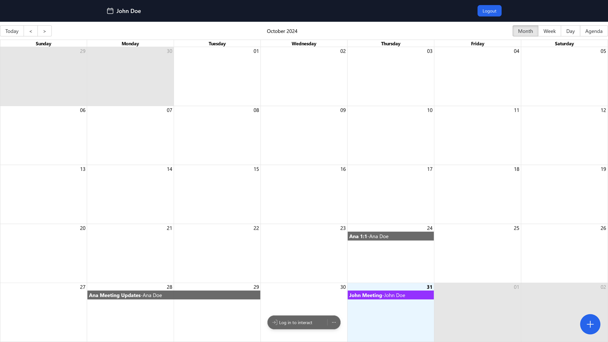

<div align="center">
  <div>
    
    
    
    
    
    
    
    
    
  </div>

  <a href="https://calendar-website-dlamli.vercel.app" target="_blank">
    
  </a>
  <h3 align="center">Calendar Website</h3>

   <div align="center">
      Calendar Website developed with React.js, Javascript, Typescript, TailwindCSS, Redux ToolKit, Tanstack Form, MongoDB, and custom <a href="https://github.com/dlamli/calendar-api">Calendar-API</a>.
    </div>
</div>

## 📋 <a name="table">Table of Contents</a>

1. ⚙️ [Tech Stack](#tech-stack)
2. 🔋 [Features](#features)
3. 🤸 [Quick Start](#quick-start)

## <a name="tech-stack">⚙️ Tech Stack</a>

- Vite
- React.js
- Tailwind CSS
- Typescript
- Javascript
- Redux RTK
- MongoDB
- Node.js

## <a name="features">🔋 Features</a>

👉  REST-API for authentication with Node.js, MongoDB, Express, and Mongo Atlas.

👉  CRUD of Calendar Events.

👉  Login and registration for users.

👉  Error validations.

👉  Reusable components, and custom hooks.

👉  Github authentication integration

👉  Client form validation with Tanstack Form.

## <a name="quick-start">🤸 Quick Start</a>

Follow these steps to set up the project locally on your machine.

**Prerequisites**

Make sure you have the following installed on your machine:

- [Git](https://git-scm.com/)
- [Node.js](https://nodejs.org/en)
- [npm](https://www.npmjs.com/) (Node Package Manager)

**Cloning the Repository**

```bash
git clone https://github.com/dlamli/calendar-website.git
cd spotify-website-clone
```

**Installation**

Install the project dependencies using npm:

```bash
npm install
```

**Running the Project**

```bash
npm run dev
```
</a>
